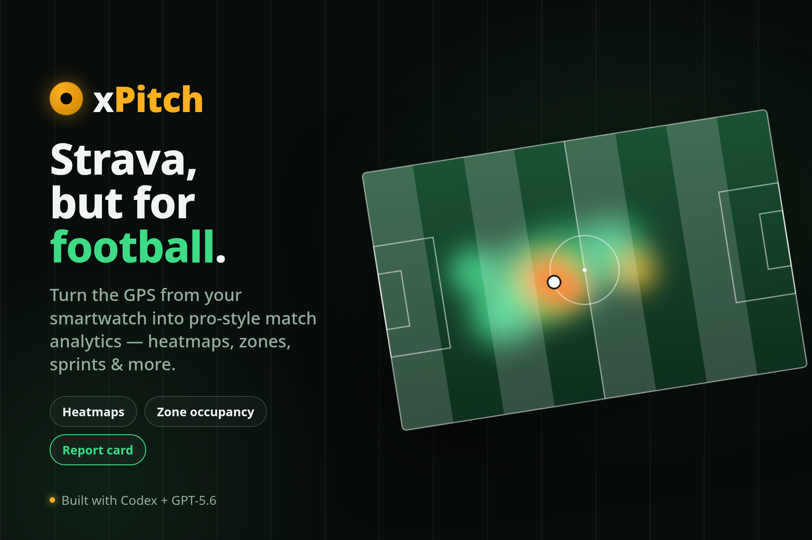

# xPitch

[xPitch](https://ismailsunni.id/xpitch/) is a football, mini-soccer, and futsal match analyzer for GPS FIT, GPX,
and TCX activity recordings. Upload a recording to turn it into positional, running,
physiological, and football-specific analysis. Use it without an account for
local analysis, or connect Supabase to save matches, share them, manage fields,
and keep a history.

Built with Vue 3, Vite, TypeScript, and Supabase. The production app is
published at [ismailsunni.id/xpitch](https://ismailsunni.id/xpitch/).

- Source code: [github.com/ismailsunni/xpitch](https://github.com/ismailsunni/xpitch).
- Demo: [YouTube](https://www.youtube.com/watch?v=WCeoq0-hS1k).
- Submission: [Devpost](https://devpost.com/software/xpitch).



## Features

- Parse FIT, GPX, and TCX recordings in the browser, with no upload required for local use.
- Install xPitch as a PWA for an app-like shell; Android users can share FIT, GPX,
  or TCX files directly from their file manager, while desktop Chromium can open
  those files with xPitch. The regular file picker remains available everywhere.
- Connect Strava to sync the latest 100 activities and import their GPS, speed,
  distance, and heart-rate streams into the same analysis and save flow.
- Analyze pitch position, movement trail, heatmap, distance, speed zones,
  sprints, heart rate, recovery, workload, fatigue, and estimated role.
- Define a field on a map or from coordinates for more accurate pitch mapping.
- Split recordings into sessions and matches, automatically treating sustained
  missing-record periods as rest; refine every play/rest boundary in the split editor.
- Save and share matches with a Supabase account, browse public profiles and
  match feeds, and review a personal history dashboard.
- Keep owner-only match notes and upload match photos with public or private
  visibility.
- Export a match map as an Instagram Story or post image. Stories can include
  an uploaded match photo, distance, top speed, inferred playing role, and the
  saved-match URL.
- Load a bundled real sample or a generated synthetic demo when no activity file is
  available.

## Quick Start

Requirements: Node.js 20 or later and npm.

```bash
npm install
npm run dev
```

Vite prints the local URL, normally `http://localhost:5173/xpitch/`.

The analyzer works without any environment configuration. In that mode, account
and cloud-save features are hidden and recordings stay in the browser.

To enable Supabase features, create `.env.local`:

```dotenv
VITE_SUPABASE_URL=https://your-project.supabase.co
VITE_SUPABASE_ANON_KEY=your-anon-key
```

The anonymous key is intentionally browser-visible; database and storage access
is enforced by Supabase Row Level Security policies. Never put a service-role
key in a `VITE_` variable or in client code.

## Common Commands

```bash
npm run dev        # start the development server
npm run typecheck  # validate TypeScript and Vue types
npm run test        # run Vitest in watch mode
npm run test:run    # run the unit test suite once
npm run build       # create dist/ and its GitHub Pages 404 fallback
npm run preview     # serve the production build locally
npm run ci          # typecheck, tests, then production build
```

Unit tests live next to the logic they cover in `src/lib/*.test.ts`. See
[docs/testing.md](docs/testing.md) for the test strategy and CI coverage.

## Supabase

The browser app uses Supabase Auth, Postgres, and Storage. Schema changes are
versioned in `supabase/migrations/`; apply them through the Supabase CLI rather
than copying SQL into the dashboard.

Install dependencies first, then authenticate and link the repository once:

```bash
npx supabase login
npx supabase link --project-ref your-project-ref
```

Apply local migrations to the linked project:

```bash
npx supabase db push
```

Useful read-only checks:

```bash
npx supabase projects list
npx supabase migration list --linked
```

### First admin

Roles are stored in `public.user_privileges`; no email address is hardcoded in
the application. On a new deployment, bootstrap the first administrator once
from the Supabase SQL editor, using that user's Auth UUID:

```sql
insert into public.user_privileges (user_id, level)
values ('<auth-user-uuid>', 'admin')
on conflict (user_id) do update set level = excluded.level;
```

Administrators can then grant or revoke roles from `/admin`. The database
prevents removal of the final administrator.

`0007_schema_review_additions.sql` creates the privilege, private-note, Strava,
and match-media schema, including the private `match-media` storage bucket.
Strava OAuth, token refresh, activity sync, and stream import run in Supabase
Edge Functions. Set `STRAVA_CLIENT_ID`, `STRAVA_CLIENT_SECRET`,
`STRAVA_REDIRECT_URI`, and `STRAVA_STATE_SECRET` as function secrets; never put
the client secret in `VITE_` variables. Deploy the functions after changes with:

```bash
npx supabase functions deploy strava-connect strava-callback strava-sync strava-import strava-disconnect
```

The schema rationale and outstanding work are in
[docs/db-schema-review.md](docs/db-schema-review.md).

For local Supabase development, start Docker and run:

```bash
npx supabase start
```

The checked-in `supabase/config.toml` contains the local service configuration.
Use the local URL and anonymous key reported by the CLI in `.env.local` when
testing against it. Stop the local services with `npx supabase stop`.

## Deployment

GitHub Actions deploys every push to `main` to GitHub Pages through
[.github/workflows/deploy.yml](.github/workflows/deploy.yml). Configure GitHub
Pages to use **GitHub Actions** as its source, then set these repository secrets:

- `VITE_SUPABASE_URL`
- `VITE_SUPABASE_ANON_KEY`

The deploy build can run without those secrets, but the resulting site is
local-only. `vite.config.ts` uses `/xpitch/` as the base path and the build
copies `index.html` to `404.html`, allowing direct navigation to app routes on
GitHub Pages. The same build generates the web manifest and service worker for
the installed PWA. It pre-caches only the application shell; activity files
shared into xPitch are held locally only long enough to hand them to the normal
browser-side importer.

The separate CI workflow runs on pull requests, pushes to `main`, and manual
dispatch. It runs `npm run ci` on Node 20.

## How Codex and GPT-5.6 Were Used

xPitch was initially developed with Claude assistance, recorded in commit
[`a9acd52`](https://github.com/ismailsunni/xpitch/commit/a9acd52)
through its co-author trailer. Most subsequent work, including the guided FIT
upload flow, GPX/TCX normalization, reusable play/rest session splitting,
saved-match editing, Supabase schema and media, pitch creation/editing with map
search, Story image export, history dashboard, tests, and CI, has been developed
with GPT-5.6 through Codex as the coding collaborator. Codex was used for
implementation, refactoring, spatial-analysis work such as homography-based
pitch mapping and great-circle distance calculations, database migrations,
verification, and CI integration; product direction and review remained with
the project maintainer.

## How Analysis Works

FIT parsing and metric calculation happen in the browser. A field can be
inferred from the GPS track, but that result is relative to the movement
observed in the recording. Define the actual field for reliable alignment and
orientation: open the field editor, place four corners on the map, or paste a
GeoJSON polygon/four coordinate pairs. Mapping uses a homography so rotated
fields and slightly imperfect rectangles are supported.

GPS and heart-rate metrics are estimates. Accuracy depends on GPS quality,
sampling rate, watch placement, and the input data available in the recording.
Sustained gaps in record timestamps are treated as rest when a recording is
split into sessions. Adding age or maximum heart rate improves zone
calculations. The attacking end can be flipped per match and period when teams
switch sides.

No recording handy? Use **Load sample** for the bundled sample in
`public/samples/`, or use the synthetic demo from the analyze screen. Developer
hooks are also available: `#autosample`, `#autodemo` (optionally
`#autodemo/positional`), and `#autoload=<url>[,<url>]`.

## Project Structure

```text
src/
  components/  dashboard, field editor, upload, sharing, and navigation UI
  lib/         FIT parsing, analytics, geo mapping, charts, API, and auth
  views/       feed, analyzer, match, history, profile, field, and settings pages
  store.ts     reactive analysis state
supabase/
  migrations/  ordered Postgres, RLS, and Storage schema migrations
docs/
  testing.md           test strategy
  db-schema-review.md  schema review and future database work
```

## Data and Privacy

Personal activity files are ignored by Git because they can contain location data.

For manual parser checks, use the synthetic 11-a-side fixtures in
`public/samples/football-11v11.gpx` and `public/samples/football-11v11.tcx`,
or the four-session mini-soccer FIT fixture
`public/samples/mini-soccer-4-sessions-roles.fit`. The FIT sessions model a
striker, goalkeeper, left-back, then striker on the seeded Amikom Soccer Arena
pitch.
Local analysis keeps recordings in the browser. When a signed-in user saves a
match, the selected match data is stored in Supabase under the permissions
defined by the migrations. Private notes and private media are only accessible
to their match owner; public media follows the visibility selected by that
owner.
